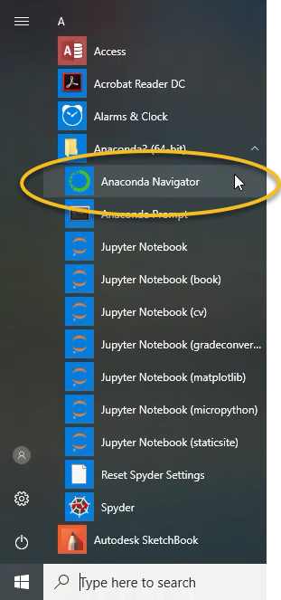

---
jupytext:
  text_representation:
    extension: .md
    format_name: myst
    format_version: '0.9'
    jupytext_version: 1.5.0
kernelspec:
  display_name: Python 3
  language: python
  name: python3
---

## Opening a Jupyter Notebook

+++

In this section, you will learn how to open a Jupyter notebook on Windows and MacOS.

One way problem solvers can write and execute Python code is in Jupyter notebooks. Jupyter notebooks contain Python code, the output that code produces and markdown cells usually used to explain what the code means.

On Windows, a Jupyter notebook can be started from the **Anaconda Prompt**, the Windows start menu and **Anaconda Navigator**.

#### 3 ways to open a **Jupyter notebook**:

 * Windows Start Menu

 * **Anaconda Prompt**

 * Anaconda Navigator

+++

### Open a Jupyter notebook with the Windows Start Menu

+++

One way to open a Jupyter notebook is to use the Windows Start Menu. Note that the Anaconda distribution of Python must be installed to use the Windows Start Menu to open a Jupyter notebook. Download **Anaconda** at the following link: [Anaconda.com/distribution](https://www.anaconda.com/distribution/)

Open the Windows start menu and select **[Anaconda3(64 bit)]** --> **[Jupyter Notebook]**


This action opens the **Jupyter file browser** in a web browser tab. 

In the upper right select **[New]** --> **[Python 3]**


A new **notebook** will open as a new tab in your web browser.


Try typing the code below in the first cell in the notebook to the right of the ```In [ ]:``` prompt:

```python
import this
```

Then click the run button in the middle of the menu at the top of the notebook.


+++

### Open a Jupyter Notebook with the Anaconda Prompt

+++

Another method to open a Jupyter notebook is to use the **Anaconda Prompt**.

Go to the Windows start menu and select **[Anaconda Prompt]** under **[Anaconda3]**.


If you don't see the **Anaconda Prompt** in the Windows Start Menu, then you need to install the Anaconda distribution of Python. Download **Anaconda** at the following link: [Anaconda.com/distribution](https://www.anaconda.com/distribution/)

The **Anaconda Prompt** window should look something like the image below.


At the **Anaconda Prompt** type:

```text
> jupyter notebook
```

This command starts the **Jupyter notebook** server. The output in the **Anaconda Prompt** will look something like the output shown below:


```text

Copy/paste this URL into your browser when you connect ...

    to login with a token:

        http://localhost:8888/?token=6bdef677d3503fbb2 ...

[I 16:14:12.661 NotebookApp] Accepting one-time-token ...

```


A web browser should open, and you should be able to see the **Jupyter file browser**. If a web browser doesn't open automatically, you can copy the web address from the **Anaconda Prompt** and paste it into a web browser's address bar.


In the upper right select **[New]** --> **[Python 3]**


You will see a new tab open in your web browser. This web browser page is a **Jupyter notebook**.


+++

### Open a Jupyter Notebook with Anaconda Navigator

+++

One additional way to open a Jupyter notebook is to use **Anaconda Navigator**. Anaconda Navigator comes with the Anaconda distribution of Python. Open **Anaconda Navigator** using the Windows start menu and select **[Anaconda3(64-bit)]** --> **[Anaconda Navigator]**.



An **Anaconda Navigator** window will open. In the middle of the page, in the **Jupyter notebook** tile, click **[Launch]**


A **Jupyter file browser** will open in a web browser tab. 

In the upper right select **[New]** --> **[Python 3]**


A new notebook will open as a new tab in your web browser.


```{code-cell} ipython3

```
