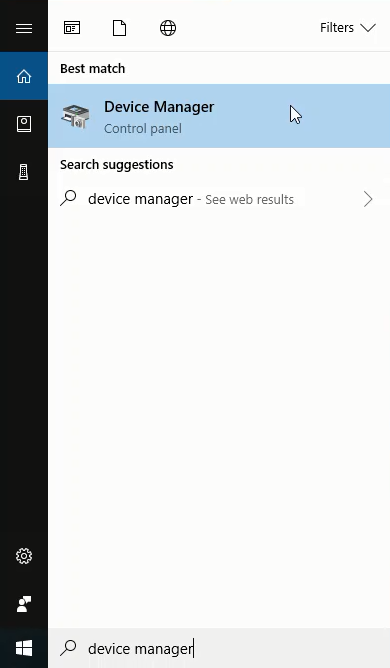
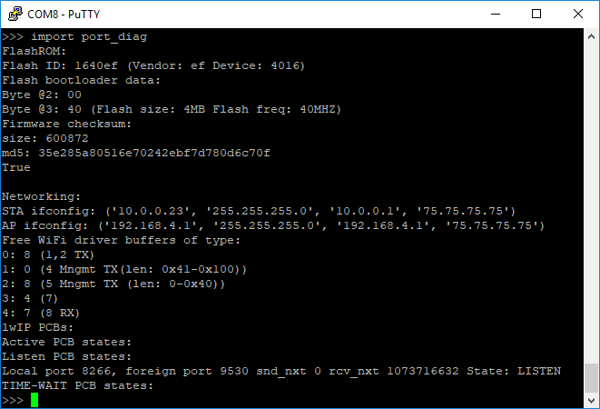

---
jupytext:
  text_representation:
    extension: .md
    format_name: myst
    format_version: '0.9'
    jupytext_version: 1.5.0
kernelspec:
  display_name: Python 3
  language: python
  name: python3
---

## The MicroPython REPL

+++

The last section detailed the installation of MicroPython on an ESP8266-based microcontroller using Python and a package called **esptool**. In this section, you will learn how to write commands to the MicroPython REPL (the Micropython prompt) to turn an LED on and off.

Before you can use the MicroPython REPL (the MicroPython prompt) running on a microcontroller, MicroPython needs to be installed on the board. A serial communication tool, like PuTTY,  also needs to be installed on your computer to communicate with the microcontroller over a serial line. The previous section detailed how to install MicroPython on an ESP8266-based microcontroller and how to install [PuTTY](https://www.putty.org/) on Windows.

+++

### Summary of Steps

+++

1. Connect the ESP8266-based microcontroller to your computer with a USB cable
2. Determine which COM port the microcontroller is connected to using the Windows Device Manager 
3. Open PuTTY and connect to the ESP8266-based microcontroller
4. Run commands at the MicroPython REPL

+++

### Connect the ESP8266-based microcontroller to your computer with a USB cable

+++

Use a microUSB cable to connect the microcontroller to the computer. Make sure that the microUSB cable is a full USB data cable and not just a simple power cable. Cables that are just used to charge phones may only be power cables and may not be capable of transmitting data.

+++

### Determine which COM port the microcontroller is connected to using the Windows Device Manager 

+++

Use the Windows Device Manager to determine which serial port the microcontroller is connected to. On Windows, the microcontroller usually comes up as ```COM4```. You can find the serial port by looking in the Ports (COM & LPT) category of the Windows Device Manager. Look for something like **Silicon Labs CP210x USB to UART Bridge (COM4)** in the **Ports (COM & LPT)** menu. It is the **COM#** that's needed to connect to the board.




+++

### Open PuTTY and connect to the ESP8266-based microcontroller

+++

Ensure the microcontroller is connected to your computer with a USB cable. Then initialize serial communication between the microcontroller and your computer with PuTTY. In PuTTY set the proper serial port (COM#) and 115200 baud. Remember to use the **[Serial[** radio button under **[Connection Type:]** to select serial communication or PuTTY will attempt to communicate with the microcontroller over SSH which won't work. 


In PuTTY, click **[Open]**  to bring up the MicroPython REPL prompt ```>>>```. If you can't see the ```>>>``` prompt, try typing [Enter], [Ctrl]-[D], pushing the RESET button on the microcontroller or unplugging then replugging the USB cable.


+++

### Run commands at the MicroPython REPL

+++

At the MicroPython REPL (the MicroPython command prompt ```>>>```) try the following commands:

```text
>>> print('MicroPython for Engineers!')
MicroPython for Engineers
```

If you import the ```sys``` module, you can see the MicroPython implementation and platform. 

```text
>>> import sys
>>> sys.implementation
(name='micropython', version=(1, 9, 3))
>>> sys.platform
'esp8266'
```


If you see similar output, that means MicroPython is working on the ESP8266-based microcontroller. You can also view the flash memory size of your microcontroller and the size of the MicroPython firmware you installed. Try the command below at the MicroPython prompt:

```text
>>> import port_diag
```



In the results above, you  can see the flash memory size is 4 MB. Below the label ```Firmware checksum:``` you can see a line for ```size: 600872```. ```size: 600872``` means the size of the Micropythpon installation is about 600 KB or about 0.6 MB. Just over half a megabyte on the microcontroller and you are running a working version of Python!

Now try a simple for loop. When you initiate a loop, the MicroPython REPL automatically indents the next line. A tab is not needed on code lines below a loop statement. To run the loop, type backspace on an empty line (to backspace away from an indented line) and hit [Enter].

```text
>>> for i in range(5):
...     print("Problem Solving with MicroPython!")
...

Problem Solving with MicroPython!
Problem Solving with MicroPython!
Problem Solving with MicroPython!
Problem Solving with MicroPython!
Problem Solving with MicroPython!
```

```{code-cell} ipython3

```
