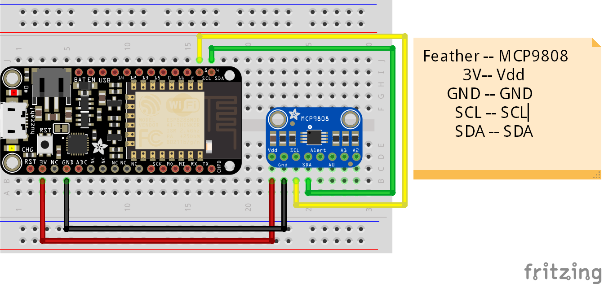

---
jupytext:
  text_representation:
    extension: .md
    format_name: myst
    format_version: '0.9'
    jupytext_version: 1.5.0
kernelspec:
  display_name: Python 3
  language: python
  name: python3
---

## Reading a Sensor

+++

In this section, you will learn how to connect a temperature sensor to an ESP8266-based microcontroller and use the MicroPython REPL to read the temperature. This section includes specifics for the Adafruit Feather Huzzah ESP8266 microcontroller and the [MCP9808 temperature sensor](https://www.adafruit.com/product/1782). Other ESP8266-based microcontrollers and temperature sensors could be used instead, but the specifics of the procedure may be different from what's shown in this section.

Before you can use MicroPython to read a temperature sensor, MicroPython needs to be installed on the board, and PuTTY needs to be installed on your computer (on MacOS and Linux, use a terminal and  ```screen```) to communicate with the board over serial.

+++

### Summary of Steps

+++

1. Connect the MCP9808 temperature sensor to the Adafruit Feather Huzzah ESP8266 microcontroller
2. Connect the Adafruit Feather Huzzah ESP8266 microcontroller to the computer with a USB cable and bring up the MicroPython REPL with PuTTY
3. Run code at the MicroPython REPL to measure the temperature

+++

### Connect the MCP9808 temperature sensor to the Adafruit Feather Huzzah ESP8266 microcontroller

+++

Connect the [MCP9808 temperature sensor](https://www.adafruit.com/product/1782) breakout board to the Adafruit Feather Huzzah ESP8266 microcontroller with jumper wires. There are four connections: A 3V power line from the Feather Huzzah to the MCP9808 Vdd pin, GND connected between both boards, and the I2C data and clock lines connected between the two boards. On the Feather Huzzah ESP8266, the I2C data line is SDA (pin 4) and the I2C clock line is SCL (pin 5). These pins on the microcontroller connect with the MPC9808 I2C data line SDA and the MPC9808 I2C clock line SCL. Unlike serial communication where RX connects to TX, in I2C communication SDA connects to SDA and SCL connects to SCL.

| Feather Huzzah | wire | MCP9808 |
| --- | --- | --- |
| 3V | red | Vdd |
| GND | black | GND |
| SDA (pin 4)| green | SDA |
| SCL (pin 5)| yellow | SCL |



+++

### Connect the Adafruit Feather Huzzah ESP8266 microcontroller to the computer with a USB cable and bring up the MicroPython REPL with PuTTY

+++

Connect the Adafruit Feather Huzzah ESP8266 to the computer with a microUSB cable. Ensure the cable is a USB data cable, not just a power cable. Open PuTTY and connect to the Feather Huzzah using the proper serial port (COM#) and 115200 baud. (Remember to use the **Serial** radio button under **Connection Type:**)


Clicking [Open] will bring up the MicroPython REPL prompt ```>>>```. If you can't see the ```>>>``` prompt, try typing [Enter] or [Ctrl]+[D] or push the RESET button on the Feather Huzzah. If none of these methods work, try closing PuTTY and unplugging then replugging in the USB cable then reopen PuTTY.

+++

### Run code at the MicroPython REPL to measure the temperature

+++

At the MicroPython REPL, import the ```machine``` module and then create an instance of the ```machine.I2C``` class. Set the ```scl``` and ```sda``` parameters as ```scl=machine.Pin(5)``` and ```sda=machine.Pin(4)```.  Next, create an empty ```bytearray``` to store the data coming in from the MCP9808 temperature sensor. As strings in Micropython are UTF-8 encoded by default (like in Python 3), a _bytearray_ needs to be used to read the raw output from the MCP9808 chip registers. The command ```i2c.readfrom_mem_into()``` reads the data from the sensor and saves it to the ```byte_data``` variable. The arguments inside the ```i2c.readfrom_mem_into()``` method ```24``` and ```5``` correspond to the I2C memory address and registry address of the temperature data stored in the MCP9808 temperature sensor.   

```text
>>> import machine
>>> i2c = machine.I2C(scl=machine.Pin(5), sda=machine.Pin(4))
>>> byte_data = bytearray(2)
>>> i2c.readfrom_mem_into(24, 5, byte_data)
>>> value = byte_data[0] << 8 | byte_data[1]
>>> temp = (value & 0xFFF) / 16.0
>>> if value & 0x1000:
...     temp -= 256.0
.....   print(temp)
```

```{code-cell} ipython3

```
